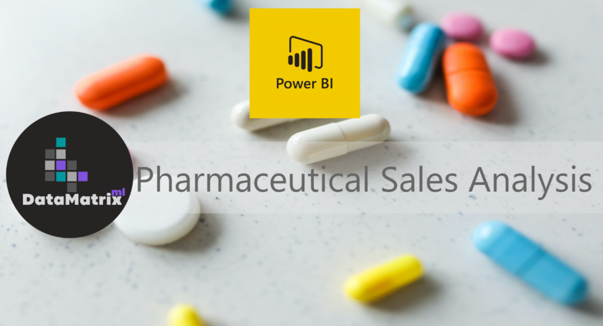
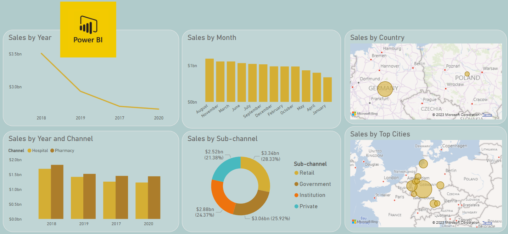
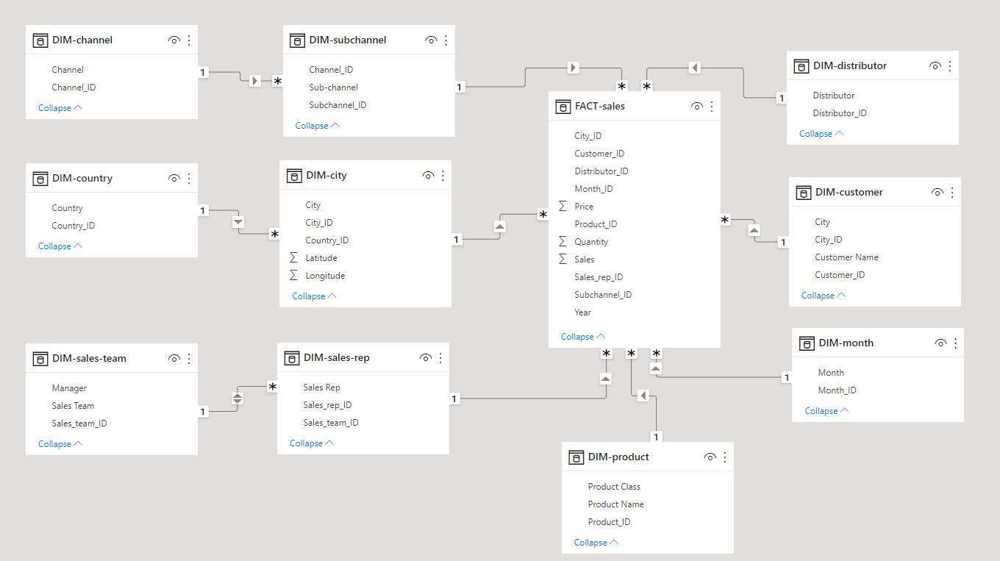
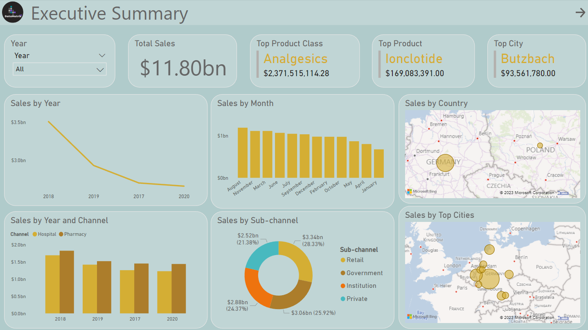
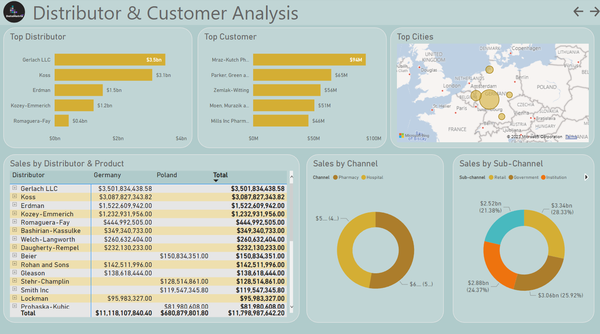
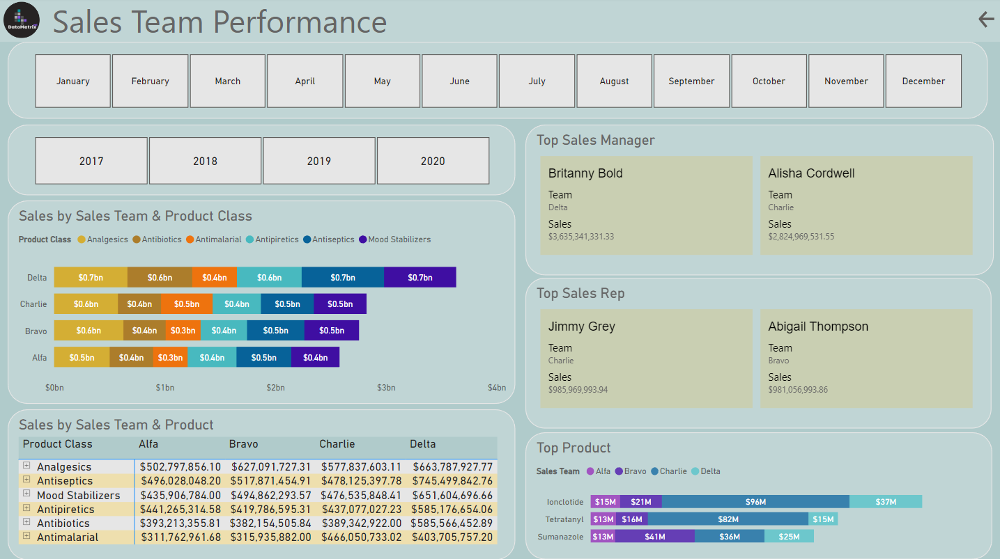

# Pharmaceutical Sales Analysis Dashboard

## Project Overview

This project analyzes pharmaceutical sales data to uncover valuable business insights related to revenue performance, customer behavior, product sales, distributor effectiveness, and sales team productivity. Using Power BI, the raw sales data was transformed into an interactive dashboard that enables stakeholders to make data-driven decisions.

---

## Dashboard Preview

---

## Business Problem

A pharmaceutical manufacturing company receives transactional sales data from multiple distributors across different markets. The objective is to consolidate this data and build an analytical solution that helps management monitor sales performance, identify growth opportunities, and evaluate sales team effectiveness.

---

## Tools & Technologies

- Power BI Desktop
- Power Query
- DAX
- Power BI Service
- Python (Pandas)
- Data Modeling (Star Schema)

---

## Dataset

The dataset contains pharmaceutical wholesale and retail sales transactions including:

- Distributor Information
- Customer Information
- Product Information
- Sales Metrics
- Channel & Sub-Channel Data
- Geographic Information
- Sales Team Information
- Time-Based Data

---

## Data Modeling

A Star Schema data model was designed to improve reporting performance and simplify analysis.

---

## Dashboard Pages

### 1. Executive Summary

Provides a high-level overview of business performance.

Key metrics include:

- Total Sales
- Sales Trends
- Top Product
- Top Drug Class
- Top Revenue City
- Channel Performance

---

### 2. Distributor & Customer Analysis

Analyzes distributor and customer performance in detail.

Key insights include:

- Distributor Contribution
- Customer Sales Analysis
- Top Products
- Top Customers
- Top Revenue Cities

---

### 3. Sales Team Performance

Measures the effectiveness of sales managers, representatives, and teams.

Key insights include:

- Sales by Team
- Sales by Manager
- Sales by Representative
- Product Contribution by Team
- Product Class Performance

---

## Key Business Insights

- Identified top-performing products and drug classes.
- Evaluated distributor contribution to overall revenue.
- Determined highest-performing customer cities.
- Measured sales team productivity.
- Compared channel and sub-channel effectiveness.
- Analyzed sales trends across multiple periods.

---

## Skills Demonstrated

- Data Analysis
- Business Intelligence
- Data Visualization
- Dashboard Development
- Power Query
- DAX
- Data Modeling
- KPI Design
- Exploratory Data Analysis

---

## License

---

## Connect With Me

  
  

